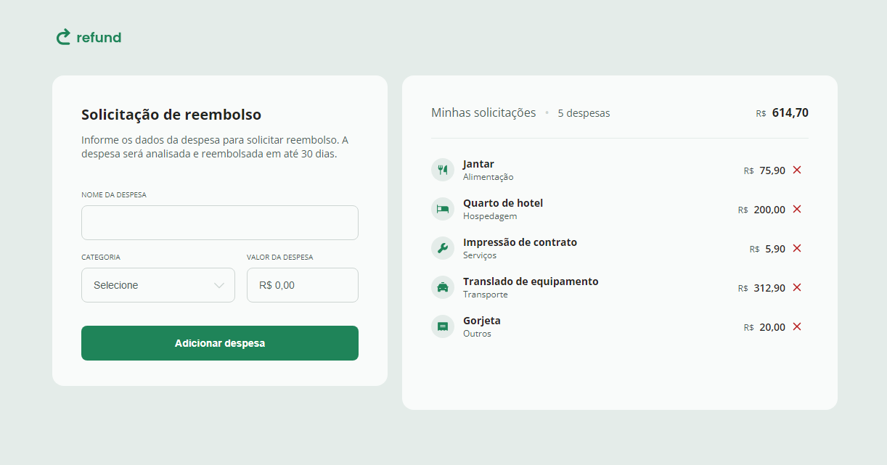

 

    

## 💻 Projeto
Esse é um projeto Web responsivo feito com o intuito de aperfeiçoar conhecimentos sobre JavaScript, construindo uma página responsiva para fazer reembolsos de gastos.

## 👩‍💻 Tecnologias
Esse projeto foi desenvolvido usando as seguintes tecnologias:

- HTML
- CSS
- GIT E Github
- JavaScript

## 🏷️ Layout
Você pode visualizar o layout do projeto através [desse link](https://www.figma.com/community/file/1360316109107378379).
É necessário ter uma conta no [Figma](https://www.figma.com).